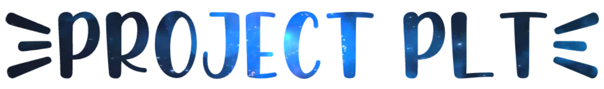

<!--
*** https://www.markdownguide.org/basic-syntax/#reference-style-links
-->
[![Contributors][contributors-shield]][contributors-url]
[![Forks][forks-shield]][forks-url]
[![Stargazers][stars-shield]][stars-url]
[![Issues][issues-shield]][issues-url]
[![MIT License][license-shield]][license-url]

# ENSEA PLT Project 2020-2021: **SLAY**

<p align="center">

  

<div align="center">

[![c++ version][cpp-ver-shield]][cpp-ver]
[![software version][version-shield]][cpp-ver]
[![build status][build-status-shield]][build-status]

</div>
</p>

<!--
<p align="center">
    
  <p align="center">
   Game render
  </p>
</p>
-->

<!-- TABLE OF CONTENTS -->
## Table of Contents

* [Introduction](#Introduction)
  * [PLT](#plt)
  * [Built With](#built-With)
* [About the Game](#about-the-game)
  * [Presentation](#Presentation)
  * [Rules](#rules)
* [Getting Started](#getting-started)
  * [Prerequisites](#prerequisites)
  * [Installation](#installation)
* [Usage](#usage)
  * [Basic Testing](#basic-testing)
* [Roadmap](#roadmap)
* [Release History](#release-history)
* [Contributing](#contributing)
* [License](#license)
* [Contact](#contact)
* [Acknowledgements](#acknowledgements)

<!-- Introduction -->
## Introduction

### PLT

The [*PLT*] **P**rojet **L**ogiciel **T**ransversal (Transversal Software Project) is the third year project in specialization [*IS*] **I**nformatique et **S**ystèmes (computer science and system) at [ENSEA](https://www.ensea.fr/fr). 

The objective is to make a video game from scratch in 112 hours of supervised practical work by following these steps : 
- Design the game
- Program it in c++
- Optimise the game
- Bring network services

At the end, it should be a finished product with advanced functionalities while being robust and scalable.

This cross-curricular project replaces and combines the labs of theses four class:
- Software Engineering
- Algorithmic
- Parallel programming
- Mobile Application and Web services

From a video games perspective, this project allows to apprehend the following points:
- Design / Graphical User Interface
- Artificial Intelligence
- Computational complexity
- Multiplayer


### Built With

* [SFML](https://github.com/SFML/SFML)
* [dia2code](http://dia2code.sourceforge.net/)
* [libxml2](http://www.xmlsoft.org/)
* [JsonCpp](https://github.com/open-source-parsers/jsoncpp)

<!-- ABOUT THE PROJECT -->
## About the game

### Presentation

[Slay](http://www.windowsgames.co.uk/slay.html) is a turn based hexagonal strategy game created by Sean O'Connor in 1995. The goal is to conquer an island by buying men and using them to capture the enemies' hexagons.

* Genre : Turn-based strategy
* players : 1 to 6 players

### Rules

See [all the rules](https://github.com/towzeur/PLT_2021/blob/master/docs/README_GAME.md).


<!-- GETTING STARTED -->
## Getting Started

To get a local copy up and running follow these simple steps.

### Prerequisites

```sh
sudo apt install python python3 libmicrohttpd-dev lcov libsfml-dev gcc cmake make libxml2-dev dia lcov libboost-all-dev gcovr python-pip
pip install gcovr
```

### Installation

1. Clone the repo
```sh
git clone https://github.com/towzeur/PLT_2021
cd PLT_2021
```

2. Build it

```sh
mkdir build
cd build
cmake .. && make
```

<!-- USAGE -->
## Usage

## Basic Testing

Print a hello world message to stdout
```sh
./bin/client hello
```

Launch a series of very simple tests to verify the proper functioning of the state implementation and display an error message otherwise.
```sh
./bin/client state
```

<!-- ROADMAP -->
## Roadmap

See the [open issues](https://github.com/towzeur/PLT_2021/issues) for a list of proposed features (and known issues).

- [ ] Design / GUI
- [ ] Artificial Intelligence
- [ ] Computational complexity
- [ ] Multiplayer

<!-- RELEASE HISTORY-->
## Release History

* 1.1
    * Implement the code to print a message
    * Report 1.1

* 1.final
    * State diagram 
    * State implementation
    * Test code coverage
    * Report 1.final

* 2.1
    * Report 2.1
    * Render diagram
    * Implemented code to print a rendering of state
<!--
* 2.2
    * Report 2.2
    * Engine diagram
    * Implemented code for the game engine
    * Print different renderings of state by calling the game engine 

* 2.final
    * Report 2.final
    * AI diagram
    * Implemented code for the Random AI
    * Player vs Random AI
    * Random AI vs Random AI

* 3.1
    * Report 3.1
    * AI diagram with Heuristic
    * Implemented code for the Heuristic AI
    * Player vs Heuristic AI
    * Heuristic AI vs Heuristic AI

* 3.final
    * Report 3.final
    * AI diagram with DeepAI
    * Implemented code for the Deep AI
    * Player vs Deep AI
    * Deep AI vs Deep AI
* 4.1
    * Report 4.1
    * Implemented the engine of the game in a different thread than the main thread
    * Implemented command serialization in JSON

* 4.2
    * Report 4.2
    * Implemented WEB API

* 4.final
    * Report 4.final
    * Implemented the final feature to make our game online
-->

<!-- CONTRIBUTING -->
## Contributing

Contributions are what make the open source community such an amazing place to be learn, inspire, and create. Any contributions you make are **greatly appreciated**.

1. Fork the Project
2. Create your Feature Branch (`git checkout -b feature/AmazingFeature`)
3. Commit your Changes (`git commit -m 'Add some AmazingFeature'`)
4. Push to the Branch (`git push origin feature/AmazingFeature`)
5. Open a Pull Request

<!-- LICENSE -->
## License

Distributed under the MIT License. See [LICENSE](license-url) for more information.


<!-- CONTACT -->
## Contact  

* [**Kaan UYGUN**](https://github.com/knuyg)
* [**Badisse BOUABDALLAH**](https://github.com/Badisse)
* [**Nicolas LARUE**](https://github.com/towzeur)
* [**Hicham SDIRI**](https://github.com/hichsdir)

[Project Link](https://github.com/towzeur/PLT_2021)


<!-- ACKNOWLEDGEMENTS -->
## Acknowledgements


<!-- MARKDOWN LINKS & IMAGES -->
<!-- https://www.markdownguide.org/basic-syntax/#reference-style-links -->
[contributors-shield]: https://img.shields.io/github/contributors/towzeur/PLT_2021.svg?style=flat-square
[contributors-url]: https://github.com/towzeur/PLT_2021/graphs/contributors

[forks-shield]: https://img.shields.io/github/forks/towzeur/PLT_2021.svg?style=flat-square
[forks-url]: https://github.com/towzeur/PLT_2021/network/members

[stars-shield]: https://img.shields.io/github/stars/towzeur/PLT_2021.svg?style=flat-square
[stars-url]: https://github.com/towzeur/PLT_2021/stargazers

[issues-shield]: https://img.shields.io/github/issues/towzeur/PLT_2021.svg?style=flat-square
[issues-url]: https://github.com/towzeur/PLT_2021/issues

[license-shield]: https://img.shields.io/github/license/towzeur/PLT_2021.svg?style=flat-square
[license-url]: https://github.com/towzeur/PLT_2021/blob/master/LICENSE

[cpp-ver-shield]: https://img.shields.io/badge/C%2B%2B-11-blue.svg
[cpp-ver]: https://en.wikipedia.org/wiki/C%2B%2B11

<<<<<<< HEAD
[build-status-shield]: https://github.com/towzeur/PLT_2021/workflows/PLT%20CI%20build%20and%20test/badge.svg
[build-status]: https://github.com/towzeur/PLT_2021/actions

=======
>>>>>>> 24f88204de455a7caa6b665a43654cffdd5fcc7b
[version-shield]: https://img.shields.io/badge/version-1.final-blue.svg?cacheSeconds=2592000
